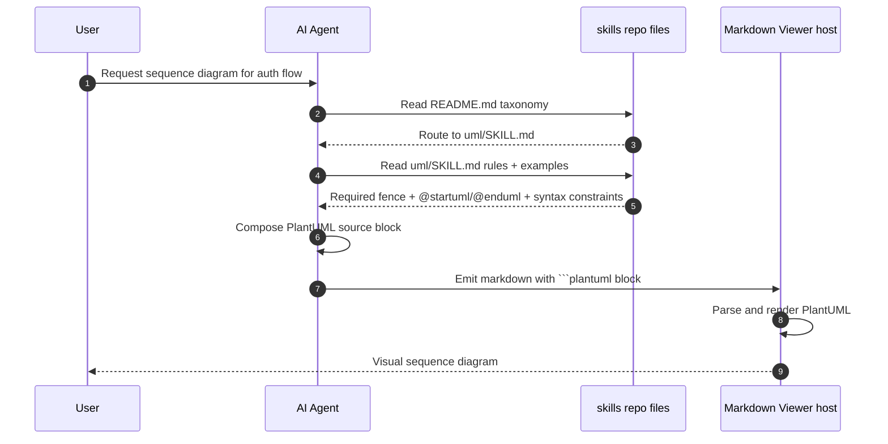

# Architecture Diagrams

## 1) System Architecture Diagram

```mermaid
flowchart LR
    U[User Prompt] --> A[AI Agent Runtime]
    A --> C[Skill Selector\n(README taxonomy)]
    C --> S[Selected SKILL.md\n(e.g., uml/SKILL.md)]
    S --> N[Syntax Normalizer\n(rules + templates)]
    N --> O[Diagram Source Block\nPlantUML/Vega/Canvas/HTML]
    O --> R[Markdown Viewer Renderer\n(or compatible host)]
    R --> V[Rendered Visual Output]

    S --> X[Examples / References / Stencils]
    X --> N
```

## 2) Core Data-Flow Sequence (UML skill)


