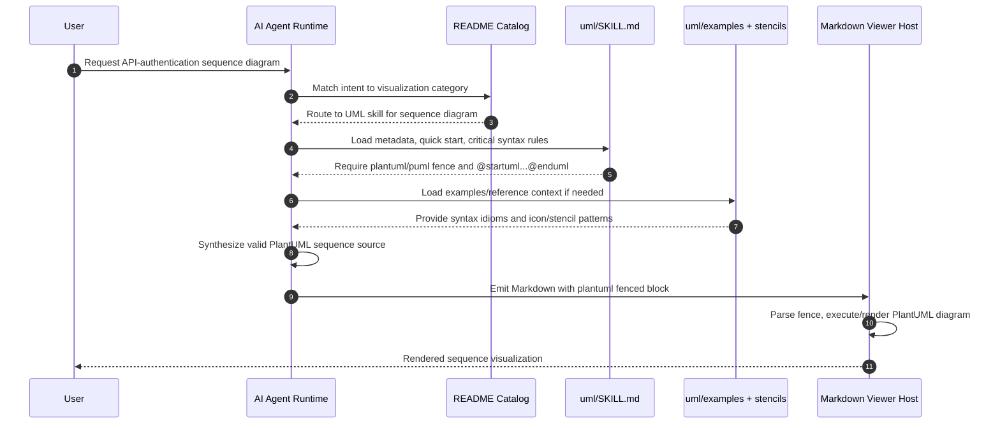
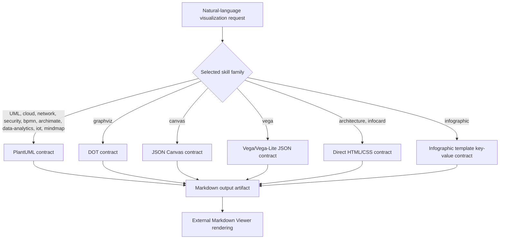

# Architecture Diagrams

These diagrams model the repository as a **declarative skill library**. The target repository does not contain an executable application runtime; the runtime actors are the external AI agent and Markdown Viewer-compatible renderer.

## 1) System Architecture Diagram

```mermaid
flowchart LR
    subgraph Human[Human intent]
        U[User request\n"Create a diagram/chart/card"]
    end

    subgraph Agent[AI agent runtime]
        RQ[Intent classification]
        SEL[Skill selection]
        CTX[Context loading]
        GEN[Artifact generation]
    end

    subgraph Repo[markdown-viewer/skills repository]
        CAT[README catalog\nuse-case taxonomy]
        SK[SKILL.md contract\nmetadata + critical rules]
        EX[examples/]
        REF[references/]
        STL[stencils/]
        LAY[layouts/ + styles/]
    end

    subgraph Output[Markdown artifact families]
        PU[PlantUML / PUML]
        DOT[Graphviz DOT]
        CAN[JSON Canvas]
        VEG[Vega / Vega-Lite JSON]
        HTML[Direct HTML/CSS]
    end

    subgraph Render[External rendering boundary]
        MV[Markdown Viewer\nor compatible host]
        VIS[Rendered SVG/HTML/canvas view]
    end

    U --> RQ --> SEL
    SEL --> CAT
    SEL --> SK
    SK --> CTX
    EX --> CTX
    REF --> CTX
    STL --> CTX
    LAY --> CTX
    CTX --> GEN
    GEN --> PU
    GEN --> DOT
    GEN --> CAN
    GEN --> VEG
    GEN --> HTML
    PU --> MV
    DOT --> MV
    CAN --> MV
    VEG --> MV
    HTML --> MV
    MV --> VIS
```

## 2) Core Data-Flow / Sequence Diagram (UML request)



## 3) Renderer-Family Dispatch Diagram


