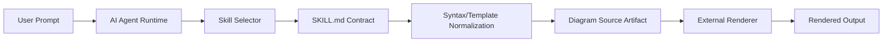
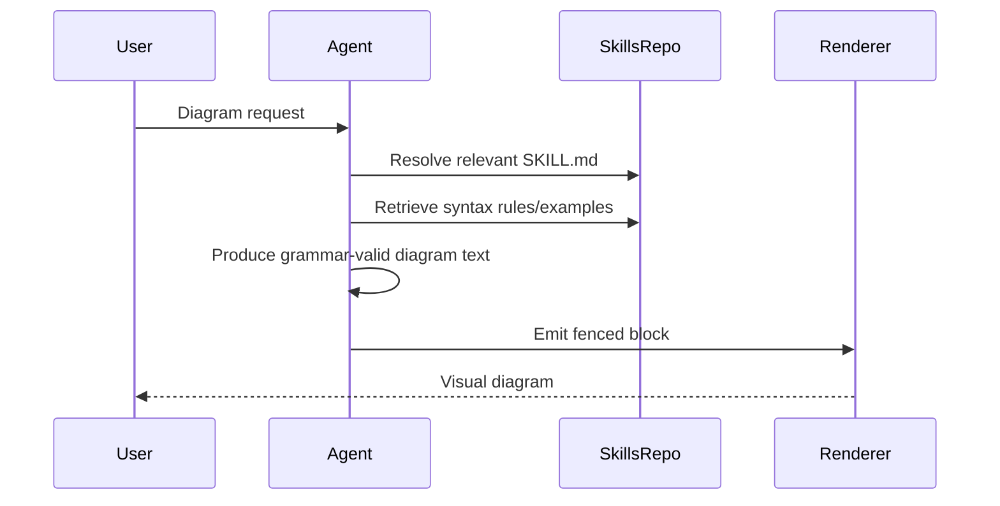

# Technical Principles and Architecture of Markdown-Viewer/Skills

## 1. Executive Summary
This repository is not a traditional software application; it is a declarative architecture of agent skill specifications. The core principle is **contract-first prompting**: each `SKILL.md` defines strict syntax constraints, examples, and domain conventions that transform natural-language requests into renderable diagram source code.

## 2. Core Technical Principles
1. **Specification-over-execution**: behavior is encoded as markdown rules rather than runtime logic.
2. **Skill modularity**: each domain (UML, cloud, canvas, infographic, etc.) is isolated in a folder with independent instruction contracts.
3. **Grammar-constrained generation**: skills enforce output grammars (PlantUML, JSON Canvas, Vega, HTML/CSS).
4. **Renderer decoupling**: rendering is intentionally delegated to external hosts (Markdown Viewer and compatible agents).
5. **Reference-backed prompting**: examples/references/stencils act as retrieval context for consistent outputs.

## 3. System Architecture Visualization
See diagrams in `artifacts/architecture_diagrams.md`.

The repository contributes the `C/S/N` logic assets (taxonomy + contracts + templates), while rendering happens outside the repo.

## 4. Data Flow Analysis

Lifecycle is deterministic once skill is selected: request -> skill contract -> grammar-constrained artifact -> render.

## 5. Execution Evidence & Findings
- Repository clone and file inventory confirm a content-centric structure (skill folders, examples, references).
- Runtime manifest scan finds no app manifests (`package.json`, `requirements.txt`, etc.), correcting any assumption of local executable pipelines.
- Therefore, empirical verification focuses on artifact contracts rather than process runtime.

## 6. Evaluation Matrix
See `evaluation_matrix.md`.

## 7. Limitations & Recommendations
- **Limitation**: no in-repo executable runtime makes end-to-end rendering tests indirect.
- **Recommendation**: add CI linting for `SKILL.md` schema and syntax snippet validation.
- **Recommendation**: provide a minimal test harness that submits sample prompts and checks renderer success codes.

## 8. Artifacts & Reproduction Guide
1. Clone target repo.
2. Inspect `README.md` and selected `SKILL.md` files.
3. Reproduce command logs from `run_log.md`.
4. Reuse Mermaid diagrams in `artifacts/architecture_diagrams.md` for documentation.
