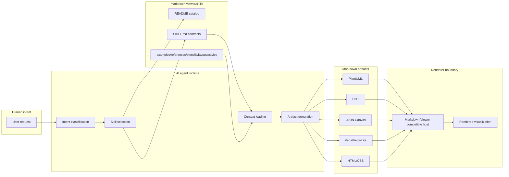
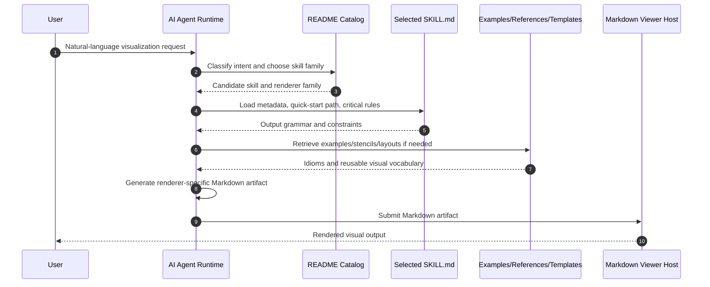

# Technical Principles and Architecture of Markdown-Viewer/Skills

## 1. Executive Summary

This investigation finds that `markdown-viewer/skills` is not an executable web application, CLI, or renderer. It is a **declarative skill-specification library** for AI agents. Its central architectural move is to encode domain-specific rendering knowledge in Markdown contracts (`SKILL.md`) so that an external agent can transform a user request into a valid Markdown-renderable artifact.

At the analyzed commit (`a3afd455b3ad37c0e71c05fa9407c4ec377226e3`), the repository contains 252 tracked files and 15 skill modules. No standard runtime/build manifest was detected. Therefore, the architecture should be understood as a content-addressable control plane for generation rather than a data plane that performs rendering itself.

## 2. Core Technical Principles

### 2.1 Contract-first generation

Each skill is a compact contract: metadata defines when to use it, the quick-start section defines the transformation recipe, and critical rules constrain syntax. This is analogous to a grammar-constrained decoder: after routing to a skill, the agent's output space is narrowed to a renderer-specific language such as PlantUML, DOT, JSON Canvas, Vega-Lite JSON, or direct HTML/CSS.

### 2.2 Separation of concerns

The repository separates four responsibilities:

1. **Selection** — catalog guidance maps user intent to a skill.
2. **Specification** — `SKILL.md` defines output grammar and pitfalls.
3. **Context expansion** — examples, references, stencils, layouts, and styles provide reusable idioms.
4. **Rendering** — external Markdown Viewer-compatible tooling renders the emitted artifact.

This separation keeps the repository lightweight but means end-to-end behavior depends on an external runtime.

### 2.3 Polymorphic renderer targets

The skill catalog is not tied to one diagram engine. It dispatches to several renderer families:

- PlantUML for UML, cloud, network, security, BPMN, ArchiMate, data analytics, IoT, and mind maps.
- Graphviz DOT for graph layouts.
- JSON Canvas for spatial node graphs.
- Vega/Vega-Lite for statistical charts.
- Direct HTML/CSS for architecture and infocard layouts.
- Infographic template syntax for templated visual summaries.

### 2.4 Example-backed and reference-backed prompting

The repository uses examples and references as a retrieval substrate. This is similar to providing few-shot exemplars and a local grammar manual to an agent. The examples reduce ambiguity, while stencils/layouts/styles expand the visual vocabulary without requiring procedural code.

## 3. System Architecture Visualization



The key architectural boundary is between artifact generation and rendering. The repository supplies generation contracts, not renderer execution.

## 4. Data Flow Analysis



For a UML sequence request, this flow selects `uml/SKILL.md`, emits a `plantuml` fenced block, and relies on the host renderer to convert PlantUML source into a visual sequence diagram.

## 5. Execution Evidence & Findings

### Verified findings

- The target repository was cloned and analyzed at commit `a3afd455b3ad37c0e71c05fa9407c4ec377226e3`.
- The target snapshot has 252 tracked files.
- Direct `SKILL.md` discovery finds 15 skill modules.
- Runtime manifest scanning found no `package.json`, `requirements.txt`, `pyproject.toml`, `Cargo.toml`, `go.mod`, `Makefile`, or `Dockerfile`.
- `scripts/analyze_skills_repo.py` generated a reproducible inventory in JSON and Markdown form.

### Assumptions corrected

- The previous draft's 14-skill count was stale; this revision records 15 skills.
- The phrase "run the project" cannot mean starting a local app for this repository. The appropriate smoke test is artifact and repository-structure validation unless an external renderer harness is supplied.

### Interpretation

The repository functions like a **prompt-runtime interface definition layer**. `SKILL.md` files are not mere documentation; they are operational specifications consumed by agents to produce valid downstream artifacts.

## 6. Evaluation Matrix

See `evaluation_matrix.md`. Summary scores:

| Dimension | Score |
|---|---:|
| Maintainability | 4 |
| Scalability | 4 |
| Clarity | 4 |
| Runtime verifiability | 2 |
| Extensibility | 5 |
| Empirical reproducibility | 4 |

## 7. Limitations & Recommendations

### Limitations

- PR review comments could not be fetched directly in this environment.
- Renderer internals were not analyzed because they are outside the target repository.
- Engine classification is based on repository text patterns and generated inventory, not a formal upstream schema.

### Recommendations

1. **Add schema validation:** enforce frontmatter keys and required sections for every `SKILL.md`.
2. **Generate README metadata:** avoid stale counts by generating skill tables from parsed metadata.
3. **Add renderer smoke tests:** validate one minimal artifact per renderer family.
4. **Publish an architecture contract:** explicitly document the boundary between skill generation and Markdown Viewer rendering.

## 8. Artifacts & Reproduction Guide

Primary artifacts:

- `README.md` — self-contained study overview.
- `notes.md` — working notes, commands, failed paths, and evidence.
- `scripts/analyze_skills_repo.py` — reproducible inventory generator.
- `artifacts/skill_inventory.json` — machine-readable inventory.
- `artifacts/skill_inventory_matrix.md` — human-readable inventory table.
- `artifacts/architecture_diagrams.md` — Mermaid architecture diagrams.
- `run_log.md` — exact command log and smoke-test result.

Reproduce the inventory:

```bash
git clone https://github.com/markdown-viewer/skills /tmp/markdown-viewer-skills
/workspace/research/markdown-viewer-architecture-study/scripts/analyze_skills_repo.py /tmp/markdown-viewer-skills /workspace/research/markdown-viewer-architecture-study/artifacts
python3 -m json.tool /workspace/research/markdown-viewer-architecture-study/artifacts/skill_inventory.json >/tmp/skill_inventory.validated.json
```
